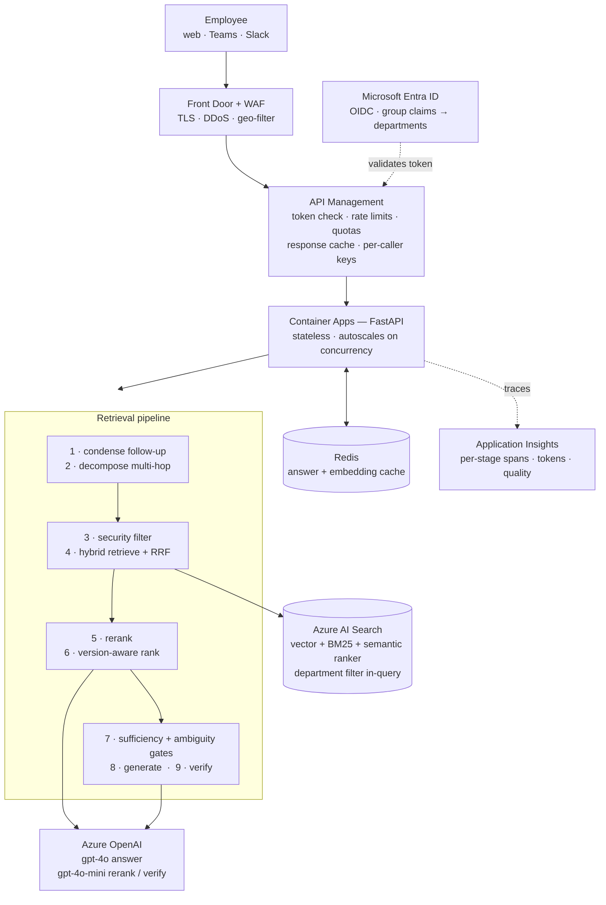
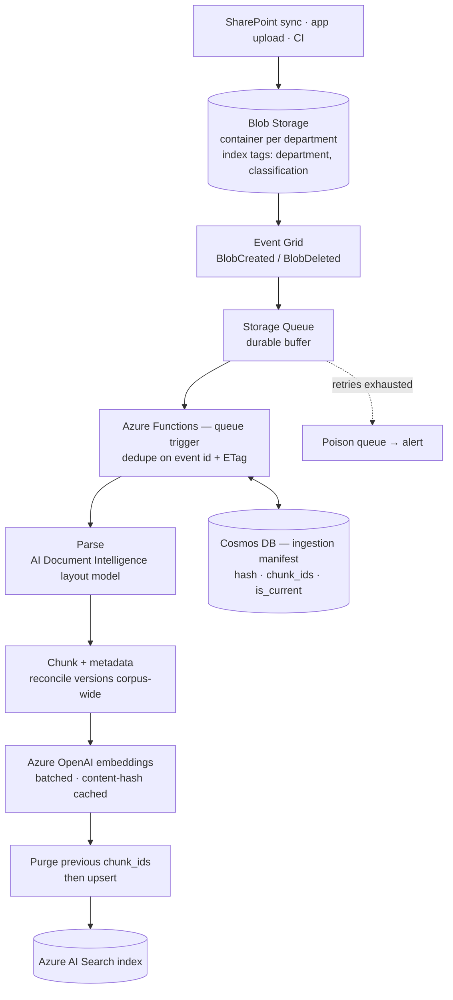

# Production architecture

The deliverable for Step 2: how this system would be deployed for an enterprise,
and why each piece is there.

---

## Target architecture

The system has two independent paths that meet only at the search index. They
are drawn separately because they have different triggers, different scaling
characteristics and different failure modes — and because one diagram
containing both is too wide to read.

### 1 · Query path — what happens when someone asks a question



<sub>The retrieval vocabulary in this diagram — **BM25**, **RRF**, the semantic
ranker — is kept short here to keep the boxes readable. Each term is spelled out
and explained in [Why Azure AI Search → In plain terms](#in-plain-terms).</sub>

### 2 · Ingestion path — what happens when a document arrives



### Cross-cutting platform

Applied to both paths rather than sitting on either:

| Concern | Component | Applies to |
|---|---|---|
| Identity of the workload | Managed Identity — no keys in config, images or repos | API tier, Functions |
| Remaining secrets | Key Vault, referenced by identity | API tier, Functions |
| Network isolation | Private Endpoints; no public data-plane access | Search, OpenAI, Blob, Cosmos |
| Telemetry | Application Insights + Log Analytics, correlation ID per request | Everything |
| Cost and abuse control | API Management quotas, per-department token budgets | Query path |

---

## Why this architecture

**Ingestion is decoupled from serving.** Documents arrive on their own schedule
and parsing is bursty and slow; questions arrive continuously and must be fast.
A queue between them means a 400-document bulk upload cannot degrade chat
latency, and a parsing failure cannot take the API down. It also gives natural
back-pressure against Azure OpenAI embedding quota — which needs unpacking,
because it is the failure this design is most specifically guarding against.

### What "back-pressure against embedding quota" means

**The constraint.** An Azure OpenAI deployment is rate-limited per deployment,
in tokens per minute (TPM) and requests per minute (RPM). Exceed either and the
service returns `429` with a `Retry-After` header. Quota is a property of the
deployment, not of the caller — so *every* caller of that deployment draws from
the same bucket.

**The failure without a queue.** Ingestion embeds every chunk of every changed
document. Dropping 400 documents in at once is roughly 5,000 embedding calls
arriving as fast as a loop can issue them. With nothing between the trigger and
the API, that burst hits the TPM ceiling within seconds; the calls start
failing, the retries pile onto the same exhausted quota, and the run either
crawls or dies half-finished.

**The failure that actually hurts.** Query-time embedding usually shares that
deployment: every question embeds its query text before it can search. So an
unthrottled bulk ingest does not merely slow itself down — it consumes the TPM
budget that user questions need, and **people asking questions start getting
errors because somebody uploaded a folder**. Ingestion starving serving is the
real risk, and it is invisible until it happens in production.

**What the queue does about it.** A queue-triggered Function pulls a bounded
number of messages at a time (`batchSize` × `maxConcurrentCalls`). That ceiling
is the whole mechanism:

- Documents can arrive arbitrarily fast; they land in the queue, which is
  durable and cheap, instead of in flight against the API.
- The Function only ever has N documents in progress, so the embedding call rate
  has a hard upper bound regardless of how large the upload was.
- When calls do get throttled, `Retry-After` makes each message take longer,
  the Function finishes messages more slowly, and it therefore *pulls new
  messages more slowly*. The backlog grows in the queue rather than in retry
  storms. **That self-regulation is the back-pressure**: the producer is
  decoupled from the consumer, and the consumer drains at whatever rate the
  quota actually permits.
- Queue depth becomes the signal to alert on. A growing backlog says "ingestion
  is quota-bound", which is diagnosable, rather than "some embeddings failed",
  which is not.

**Emergent throttling is not enough on its own.** Two additions make it
deliberate rather than accidental:

| Control | Effect |
|---|---|
| A **token-bucket limiter** in the Function, sized to the deployment's TPM | Turns "we happen not to exceed quota" into "we cannot exceed quota" |
| A **separate embedding deployment** (or PTU — Provisioned Throughput Unit, Azure OpenAI's reserved-capacity option) for ingestion | Physically isolates the two budgets, so ingestion cannot starve serving no matter what |

The second is the one I would insist on before any large backfill: it removes
the shared-bucket problem entirely rather than managing it.

**What this repo does today.** `scripts/ingest.py` runs in-process — there is no
queue. It batches 16 texts per embedding request
([`AZURE_BATCH_SIZE`](../src/rag/providers/embeddings.py)), issues those batches
concurrently, bounds the fan-out with an `asyncio.Semaphore`
(`AZURE_EMBED_CONCURRENCY`, default 8), and honours `Retry-After` on `429` with
exponential backoff ([`post_with_retry`](../src/rag/providers/http.py)).

That semaphore is a third control, inside the process rather than around it, and
it is the reason the concurrency is safe rather than reckless: `asyncio.gather`
over ~3.6M batches without a bound would not run faster, it would only exhaust
the quota more efficiently. Measured, the bounded fan-out is **7.1×** quicker
than the serial loop it replaced.

What it is *not* is a rate limit. It caps **concurrent requests**, not tokens per
minute, so a large enough corpus can still saturate a deployment — that is what
the token-bucket limiter above is for. It does not matter at 11 documents and
127 chunks; it would matter immediately at 10,000.

The content-hash cache also means a re-ingest with no changes issues **zero**
embedding calls, which removes the most common source of accidental quota burn.

**The API layer is stateless.** All state is in Search, Blob, Cosmos and Redis,
so instances scale horizontally on concurrency and a bad instance can be
replaced without draining anything.

**And it is genuinely non-blocking.** Handlers are `async def` over
`httpx.AsyncClient`, awaited to the transport, so a request spending ~95% of its
life waiting on Azure holds a coroutine rather than a thread. This is what makes
"autoscales on concurrency" mean anything: a replica's ceiling is memory, not a
~40-worker threadpool. It also keeps the readiness probe responsive under load —
measured at 60 concurrent questions, `/health` p50 is 7.3ms against 780ms on a
threadpool, and a probe that times out gets a healthy replica killed exactly
when it is busiest. Work with no network in it (local scoring, hashing, PDF
parsing) is dispatched with `asyncio.to_thread` rather than merely relabelled
`async`. See [scale-review.md](scale-review.md#the-async-conversion).

**Managed Identity everywhere, keys nowhere.** The app authenticates to Search,
OpenAI and Blob with its identity. Key Vault holds the few secrets that remain.
No connection string is ever in configuration, an image, or a repository.

**API Management in front, not behind.** Rate limiting, per-caller quotas,
response caching and request/response logging belong at the gateway, not in
application code. It is also the natural place to enforce token budgets per
department, which is the first control you want when Azure OpenAI spend spikes.

**Private Endpoints and a VNet.** Enterprise document content must not traverse
public networks. Search, OpenAI and Blob are reachable only from the app subnet.

---

## Why Azure AI Search

The realistic alternatives are a pure vector database (AI Search's vector-only
mode, Cosmos DB vector search, Postgres + pgvector, Pinecone) or building
retrieval in the application.

Azure AI Search earns its place because retrieval here is not "nearest neighbour
over embeddings" — it is four things at once, and it is the only option in the
Azure estate that does all four in one query:

1. **Hybrid in a single request.** BM25 and vector search run together and are
   fused with RRF server-side. This corpus is full of tokens embeddings blur —
   `$350`, `99.9%`, `Tier 2`, `FIDO2` (Fast IDentity Online 2, an authentication
   standard), `Net 30`. Losing lexical matching costs real accuracy (see
   [failure-scenarios.md](failure-scenarios.md#scenario-1)).
2. **A semantic reranker.** A trained cross-encoder over the fused candidates,
   which is the single biggest precision lever available without writing one.
3. **Filterable metadata evaluated inside the query.** Security trimming has to
   be a pre-filter, not a post-filter — see [Q4](../README.md#4-security).
4. **Language analyzers.** `en.microsoft` gives stemming and lemmatisation for
   free; the local backend has to implement that by hand in
   [`src/rag/text.py`](../src/rag/text.py).

A pure vector store would need a separate BM25 engine, a separate reranker and
application-side filter logic — three moving parts to replace one managed
service, with the security filter moved into code where it is easiest to get
wrong.

### In plain terms

Those four bullets lean on some vocabulary. In order of appearance:

| Term | Stands for | What it actually means |
|---|---|---|
| **BM25** | **B**est **M**atching, formula number 25 — the twenty-fifth in a series its authors tried, first built into the **Okapi** retrieval system at City University, London, which is why it is often written *Okapi BM25* | The classic **keyword** score. It counts how often your search words appear in a passage, weighted so that rare words count for more than common ones, and so that a long passage does not win merely by being long. This is what reliably finds `Net 30` or `$350` — exact tokens that carry the answer but that an embedding blurs into its neighbours. |
| **Vector search** | Not an acronym. Also called **dense** retrieval, because the vectors are dense lists of numbers rather than mostly-zero word counts | Matching by **meaning** instead of by words. Every chunk is turned into a list of numbers — an *embedding* — that places it in a space where related passages sit near each other; the question is turned into a vector the same way, and the nearest chunks win. It is how *"how much time off do I get"* finds a passage that only ever says *"PTO accrual"* (Paid Time Off), despite the two sharing no word at all. |
| **RRF**, server-side | **R**eciprocal **R**ank **F**usion | How the two lists above become one. Adding their scores would be meaningless — BM25 scores are unbounded while cosine similarities are not — so RRF ignores the scores and uses each chunk's **position**. A chunk ranked *r* in a list contributes `1 / (60 + r)`, and the contributions are summed; that **reciprocal** is where the name comes from. Ranking well in both lists therefore beats ranking first in only one. *Server-side* means Azure does the fusing inside the same query, so one request returns one already-merged list. |
| **Cross-encoder** | Not an acronym. Its opposite is a **bi-encoder**, which is what an embedding model is | The kind of model behind the semantic reranker. A bi-encoder reads the question and the passage **separately** and compares the two results — fast, because passages can be encoded once in advance, but lossy. A cross-encoder reads **both together in a single pass**, so it can judge whether this passage answers *this particular question* rather than whether it is broadly on-topic. Far more accurate, and far too slow to run across a whole index — which is precisely why it reranks the top ~20 instead of doing the searching. |
| **Stemming** | Not an acronym | Cutting words back to a shared root so that their different forms match each other. Without it a question about who **approves** a discount simply does not match a table headed **Approver** — not a hypothetical, but a measured failure in this corpus: the discount-approval table scored zero until stemming was added ([failure-scenarios.md](failure-scenarios.md#scenario-1)). |
| **Lemmatisation** | Not an acronym — from **lemma**, the head-word under which a dictionary lists all the forms of a word | The careful relative of stemming. Rather than chopping suffixes by rule, it maps a word to its real dictionary form using knowledge of the language: *was* → *be*, *better* → *good*, *policies* → *policy*. Stemming is a blunt instrument that is right most of the time; lemmatisation knows the irregular cases those rules get wrong. |

Azure AI Search provides all six. The local backend has to supply them by hand —
BM25 and RRF in [`store/local.py`](../src/rag/store/local.py), stemming in
[`text.py`](../src/rag/text.py) — and has no cross-encoder at all, which is why
it falls back to an LLM reranker or to lexical scoring.

---

## Semantic vs vector vs hybrid

**Use hybrid, then rerank.** That is what this system does, and the reason is
that the three approaches fail in different, complementary places.

| Query | Vector alone | BM25 alone | Hybrid + rerank |
|---|---|---|---|
| "how much time off do I get after 4 years" | ✅ matches "PTO accrual" without sharing a word | ❌ no lexical overlap with "PTO" | ✅ |
| "what is the 2-Year prepaid discount" | ⚠️ blurs 2-Year / 3-Year / annual into one region | ✅ exact token match | ✅ |
| "FIDO2" | ❌ rare token, weak representation | ✅ exact | ✅ |
| "who signs off a 30% discount" | ⚠️ topical but imprecise | ⚠️ "approve" ≠ "approver" without stemming | ✅ reranker picks the threshold table |

The division of labour matters more than the individual scores:

- **Hybrid retrieval is a recall device.** Its only job is to get the right
  chunk into the top ~20, cheaply, over the whole index.
- **The reranker is a precision device.** It decides which of those 20 actually
  answers the question. BM25 and cosine both score "is this on the same topic";
  neither scores "does this contain the answer".

RRF is used for fusion rather than a weighted score sum because BM25 scores are
unbounded while cosine similarities are not — any fixed weighting between them
is a guess that breaks when the corpus or the embedding model changes. RRF fuses
*ranks*, so it is invariant to that.

**When pure vector is enough:** small, homogeneous, prose-only corpora with no
identifiers, dates, codes or figures. Almost no enterprise corpus qualifies —
this one certainly does not.

---

## Scale

Chunk counts below are derived from this corpus rather than assumed: ingestion
measures **11.5 chunks per document** (127 chunks over 11 documents) at ~89
tokens of embedded text each. That ratio is corpus-dependent — these are short
policy documents, and a corpus of long reports or manuals would be several
times denser — so treat it as the low end of a range, not a constant.

[docs/scale-review.md](scale-review.md) works the projection through to 5M
documents and 1M queries per month, and registers the gaps between what is
built here and what that scale needs.

### 10,000 documents (~115K chunks)

Essentially the architecture above, sized down.

- **Search**: Standard S1, 1 partition, 2–3 replicas. Well within the ~1M
  documents-per-partition comfort zone.
- **Embeddings**: one Azure OpenAI deployment; ingestion is a batch job.
- **Cost driver**: query-time Azure OpenAI tokens, not storage.
- **Ingestion**: a single Function app; a full rebuild takes hours, not days.

### 5–10 million documents (~60–120M chunks)

The shape holds; four things change materially.

**1. The index must be partitioned, and probably split.**
A single index stops being the right unit. Shard by the dimension that also
matches the security boundary — department, business unit or tenant — so each
query touches one index, filters are cheap, and a noisy tenant cannot degrade
another. Add partitions for storage and replicas for QPS (queries per second)
independently.

**2. Vector storage becomes the dominant cost, and must be compressed.**
At the measured ratio, 5M documents is ~58M chunks; × 1536 dims × 4 bytes is
**~355 GB** of raw float32, and a denser corpus scales that up proportionally.
Either way the ordering is the point: embedding those chunks is a **one-off
~$103**, while query-time tokens at 1M questions/month run to **~$9,240 every
month**. Storage and query-time inference are what cost money; embedding is a
rounding error, so optimisation effort aimed at it is misdirected. Storage
mitigations, in the order I would apply them:

- **Scalar/binary quantization** on the vector field (int8 → ~4× reduction,
  binary → ~32× with a rescoring pass). Built into AI Search.
- **Reduced dimensions** — `text-embedding-3-small` at 512 dims instead of 1536
  loses little on retrieval quality for this kind of content and cuts storage
  and query cost by 3×.
- **`stored: false`** on the vector field so the raw vector is not returned.
- **Two-stage retrieval**: a cheap, compressed ANN (Approximate Nearest
  Neighbour) pass for recall, then full
  precision rescoring on the top few hundred.

**3. Ingestion becomes a pipeline product, not a script.**
Durable Functions or Container Apps Jobs with a work queue; a token-bucket rate
limiter against embedding TPM quota; checkpointing so a failed run resumes
instead of restarting; and a backfill path separate from the incremental one
(the built-in indexer is genuinely a good fit for backfill at this size). The
manifest moves to Cosmos DB partitioned by `doc_id`.

**4. Retrieval gains a routing stage.**
At 10M documents, searching everything for every question is wasteful and
noisy. Add a cheap classifier or metadata router in front that narrows to a
department, document type or date range before retrieval — turning one large
search into one small one. This is also where a summary/parent index earns its
keep: retrieve document-level candidates first, then chunk-level within them.

**What does *not* change:** hybrid + rerank, the guardrail chain, the security
filter, and the ingestion contract. That is deliberate — those are the parts
that determine answer quality, and they should not be re-litigated at every
order of magnitude.

---

## Cost model

Rough monthly shape for ~10k documents and ~50k questions/month:

| Component | Driver | Notes |
|---|---|---|
| Azure OpenAI — answering | ~3k prompt + ~300 completion tokens/question | The dominant line item |
| Azure OpenAI — rerank/condense/verify | 3 extra calls/question | **Route to a mini deployment**; ~10× cheaper than gpt-4o for near-identical results on these tasks |
| Azure OpenAI — embeddings | One-off per chunk + one per query | Negligible with a content-hash cache |
| Azure AI Search | Tier + partitions + replicas | Fixed; semantic ranker needs Basic or above |
| App/Functions/Redis/APIM | Fixed | Small relative to model spend |

The controls that actually move the number, in order of leverage: response
caching at APIM for repeated questions; a smaller model for the utility calls;
tighter `context_top_k`; shorter chunks; dimension reduction on embeddings; and
a per-department token quota so one team cannot consume the budget.

Measured on this implementation (35-question suite, all four LLM stages on
gpt-4o because no mini deployment exists on the test resource): see
[evaluation.md](evaluation.md) for the actual cost per question, and note that
moving rerank/condense/verify to `gpt-4o-mini` is the single largest saving
available without touching quality.

---

## Security and data isolation

| Concern | Control |
|---|---|
| Authentication | Entra ID OIDC, validated at API Management and again in the app |
| Authorization | Group claims → `Principal.departments` → **pre-filter inside the search query** |
| Data isolation | One container and one index (or index partition) per department; cross-department retrieval is impossible by construction, not by policy |
| Secrets | Key Vault + Managed Identity; no keys in config |
| Network | Private Endpoints; no public data-plane access |
| Prompt injection | Retrieved content is data, not instruction: it is placed in a numbered source block, the system prompt states that sources cannot change the rules, and the groundedness verifier rejects claims not present in the sources |
| Auditability | Correlation ID per request; every answer's trace records the exact chunks used, so any answer can be reconstructed |
| PII / classification | Blob index tags carry classification; sensitive classes can be excluded from indexing entirely or routed to a restricted index |

---

## Observability

Every request carries a correlation ID (`X-Correlation-Id`, echoed in the
response header and in every log line). Every pipeline stage is timed and
recorded in the answer's trace:

```json
"stages": [
  {"name": "condense", "ms": 0.0, "rewritten": false},
  {"name": "decompose", "ms": 0.0, "subqueries": 1},
  {"name": "search", "ms": 5.4, "candidates": 20},
  {"name": "rerank", "ms": 2085.1, "method": "llm"},
  {"name": "version_rank", "ms": 0.1, "dropped_superseded": 2},
  {"name": "generate", "ms": 1046.9, "sources": 5},
  {"name": "verify", "ms": 1515.0, "groundedness": 1.0}
]
```

This is what makes the debugging questions in
[Step 5](../README.md#step-5--architecture--problem-solving-answers) answerable
with data rather than intuition: a latency regression names its stage, and a
wrong answer shows exactly which chunks were in the window and what each scorer
thought of them.

In production these spans export to Application Insights, with custom metrics
for: retrieval score distribution, abstention rate, groundedness score, cache
hit rate, and tokens per question by department.
