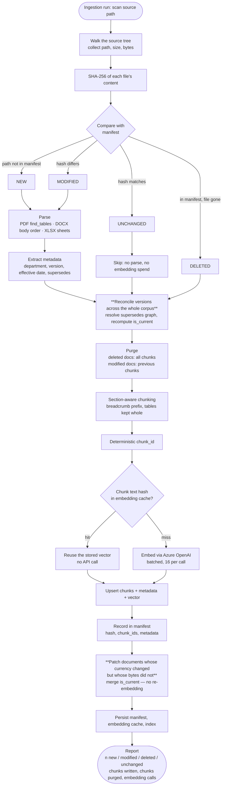
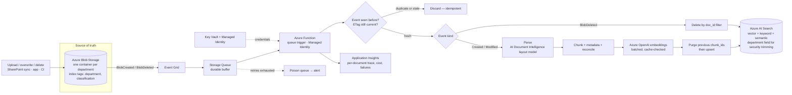

# Document lifecycle — how new, modified and deleted documents reach search

This describes what happens between "someone drops a file in the source folder"
and "the assistant can cite it", including the two cases most RAG demos skip:
documents that change, and documents that go away.

Everything below is implemented in [`src/rag/ingest/sync.py`](../src/rag/ingest/sync.py)
and [`src/rag/ingest/manifest.py`](../src/rag/ingest/manifest.py), and asserted
end to end by [`scripts/verify_lifecycle.py`](../scripts/verify_lifecycle.py).

---

## The three ideas

**Content-hash change detection.** Every indexed document's SHA-256 is recorded
in a manifest. A document whose bytes have not changed is not re-parsed and not
re-embedded — re-running ingestion over an unchanged corpus makes *zero*
embedding calls.

**Deterministic chunk IDs.** `chunk_id = sha1(doc_id + section_path + ordinal)`.
The same document produces the same IDs every time, so ingestion is idempotent:
interrupt it, run it again, and the index converges to the same state.

**Delete-then-upsert, per document.** The manifest records every `chunk_id` a
document produced. A modified document has exactly that set removed before its
new chunks are written.

---

## Process flow



---

## Why each step is shaped this way

### Hash the content, not the timestamp

Copying a file or re-saving it without edits changes `mtime` but not meaning.
Embedding is the expensive part of ingestion, so the change test has to be about
content. Measured on this corpus:

```
first run:   11 new, 0 modified, 0 deleted, 0 unchanged   127 chunks written
second run:   0 new, 0 modified, 0 deleted, 11 unchanged    0 chunks written, 0 embedding calls
```

### Reconcile versions *before* chunking, patch *after* indexing

`is_current` is not a property of a document by itself. Whether `Pricing2026.pdf`
is current depends on whether a `Pricing2027.pdf` exists. So reconciliation runs
across the whole corpus — fresh metadata for what was just parsed, manifest
metadata for everything else — and it runs **before** chunking so that new chunks
are written with the right value from the start.

That leaves one case: a document whose *own bytes did not change* but whose
currency did. Adding a 2027 rate card demotes the 2026 one, which was never
re-parsed. Step 6 patches those documents' chunks in place. This is the step a
naive implementation omits, and its absence is silent — the index keeps serving
a superseded document as current until someone happens to re-ingest the file
that replaced it.

Supersession is resolved three ways, in priority order:

1. **Explicit forward link** — "…and supersedes Pricing2025.pdf."
2. **Explicit backward link** — "See Pricing2026.pdf for current rates."
3. **Filename series convention** — `Pricing2025` / `Pricing2026` / `Pricing2027`
   share a series; the later year wins.

(3) is what keeps the system correct when a new rate card is dropped in with no
supersession sentence in it at all.

Reconciliation is also **reversible**: remove `Pricing2027.pdf` and the 2026 card
is reinstated as current on the next run.

### Currency is metadata, never embedded text

Each chunk's embedded text carries a `Title > Section` breadcrumb, the
department, the effective date and the version — but deliberately *not* whether
the document is superseded. If "SUPERSEDED" were part of the embedded string,
then adding a 2027 rate card would require re-embedding every chunk of the 2026
one. Keeping currency as a filterable/patchable field makes the demotion free.

### Delete-then-upsert, not blind upsert

If `LeavePolicy.pdf` is edited from nine sections down to seven, a plain upsert
leaves chunks 8 and 9 in the index. They still match queries, still get
retrieved, and still get cited — so a user receives a confident answer quoting a
paragraph that no longer exists in the document they are told to look at. The
manifest's `chunk_ids` list makes purging exact.

### One bad document does not stall the corpus

Parsing is per-document and wrapped: a file that fails to parse is recorded in
`report.failed`, logged with a stack trace, and skipped. Every other document in
the batch still lands. In production this is the poison-queue path.

---

## Production flow on Azure



The logical contract is identical to the local flow; only the state store moves.
The manifest becomes a small table (Blob index tags, Table Storage or Cosmos DB)
holding `doc_id → content_hash, chunk_ids, is_current`.

### Why a Function, and not the built-in indexer

Azure AI Search ships a blob indexer with a skillset, and it is far less code.
It was not chosen here because it gives up control of exactly the things this
system's retrieval quality rests on:

| Need | Indexer + skillset | Function |
|---|---|---|
| Table-aware chunking with heading breadcrumbs | Split skill is character/token based | Full control |
| Corpus-wide `supersedes` reconciliation | No cross-document step | Natural fit |
| Deletion detection | Requires a soft-delete marker you maintain anyway | Native from `BlobDeleted` |
| Chunk-level embedding cache | Not available | Straightforward |
| Per-document cost and failure telemetry | Coarse | Per-document spans |

The indexer remains a sensible tool for bulk backfill of a large historical
corpus, where its parallelism matters more than chunking control.

### Ordering, duplicates and idempotency

Event Grid delivers at-least-once and does not guarantee order. Three defences:

- **Event ID dedupe** — a repeated delivery is dropped.
- **ETag re-check** — the Function re-reads the blob's current ETag before
  writing, so a late "modified" event for a version that has since been replaced
  is discarded rather than resurrecting stale chunks.
- **Deterministic chunk IDs** — if a duplicate does slip through, it overwrites
  identical content instead of creating a second copy.

### At 10 million documents

The same flow, scaled by: fanning the Function out on queue depth; batching
embeddings and respecting Azure OpenAI TPM quota with a token-bucket limiter;
sharding across multiple search indexes or services by department or tenant;
and moving the manifest to Cosmos DB. See
[architecture.md](architecture.md#scale) for the full treatment.

---

## Verifying it

```bash
python scripts/verify_lifecycle.py
```

Copies the corpus to a temp directory, then asserts:

| # | Check |
|---|---|
| 1 | First ingest indexes all 11 documents, 127 chunks, 22 of them tables |
| 2 | Re-running with no changes parses nothing and makes **0 embedding calls** |
| 3 | Adding `Pricing2027.pdf`, editing `PasswordPolicy.docx`, deleting `VPNGuide.pdf` classifies as `1 new, 1 modified, 1 deleted, 9 unchanged` |
| 4 | The deleted document leaves **0 orphan chunks** and is no longer retrievable |
| 5 | The modified document leaves **0 stale chunks**; the new text is what is indexed |
| 6 | `Pricing2026.pdf` is demoted **without being re-parsed** (content hash unchanged, and it sits in the `unchanged` bucket) |
| 7 | The demotion reaches the index itself, not just the manifest |
| 8 | Removing `Pricing2027.pdf` again **reinstates** 2026 as current |

All 23 assertions pass.
